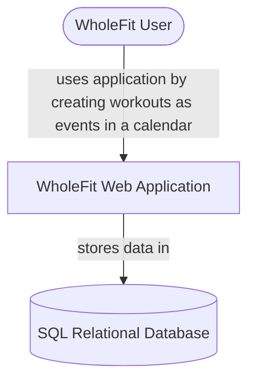
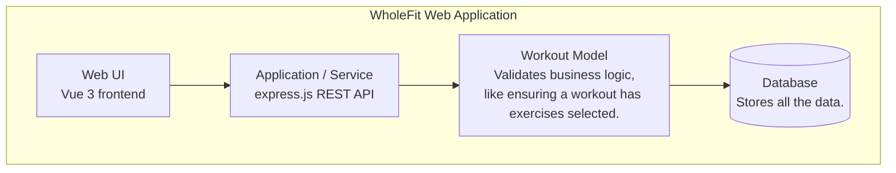
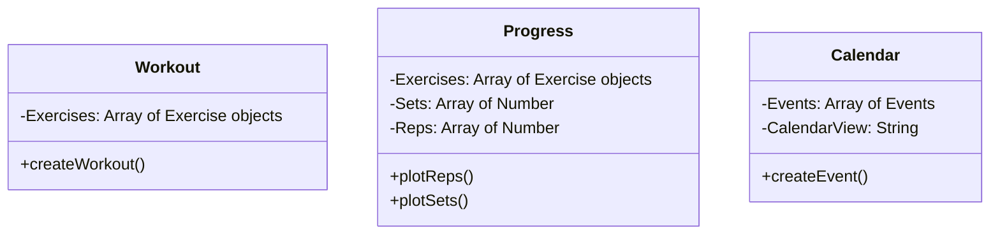
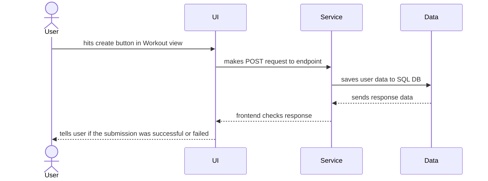

# [Your Project Name]

<!-- CI badge: after Session 4, replace ORG/REPO and the workflow filename, then uncomment:

-->

**Student:** [Josecarlos Lusbel] · **Course:** CEN 5064 Software Design, Fall 2026 · **Partner:** [@JaiKaushik03]
 
## Project (approval paragraph — write this by Sun Aug 30)

<!--[One paragraph: What is the system? Who is it for? What are its 3–4 core features?
This paragraph is your approval request — see the Project Brief, Section 2.]-->

This project will be focused on creating a web application that allows users to track their fitness progress. Anyone who is interested in tracking their fitness regimen can use this app. The current planned core features for this project are allowing the user to create a workout, allowing them to schedule their created workout, and having the web app inform them if they are making any progress (they spent more time exercising this week than the previous week, for example).

## How to run

```
[Exact commands to build and run your system from a clean clone.
Update this every time the steps change — your partner and your
instructor will follow it literally on conference days.]
```

## Architecture

### Tier breakdown (Session 2 studio)

| Tier | Responsibilities in THIS system |
|------|--------------------------------|
| Presentation | WorkoutView - modal where the user can fill out the details of their workout , CalendarView - lists all of the created workout as events on a calendar, ProgressView - shows user if they have progressed. |
| Service | createWorkout() - responsible for creating a workout, by carrying out any validation and pushing data into the DB. loadWorkout() - responsible for loading all the workouts the user has created, by retrieving data from the DB |
| Domain | Workout- must have at least 1 exercise chosen, Progress - for example, a user makes progress if they have worked out longer in the current week than the previous week |
| Data | storeWorkout() - workout data is stored to a SQL DB through an API calls. loadWorkout() - retrieves workout data from a SQL DB through an API call. |

### C4 — Context & Container (Session 3 studio)





### UML — Class & Sequence (Session 3 studio)





## Architecture Decision Records

Decisions live in [`docs/adr/`](docs/adr/). Start with ADR-001 in Session 4.

| # | Decision | Status |
|---|----------|--------|
| [001](docs/adr/adr-001.md) | [What I am building and why] | [proposed] |

## Weekly log (optional but recommended)

A one-line note per week keeps your commit story readable:

- Week 1 (Aug 24): repo created, three ideas drafted
- Week 2 (Aug 31): ...
- Week 6 (Sep 21): Working on Add a login page to the website #1, where the user will be able to create and account, login, and afterwards they will be able to use the site by adding workouts to a calendar, and seeing their progress.
